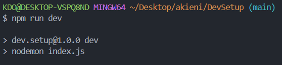

# DevSetup: environnement de developpement Fullstack 👾

Se repository èxiste dans le cadre de la cohorte 2 de la formation en développement fullstack d'Akieni Academy.

## Table de matières

- [DevSetup: environnement de developpement Fullstack 👾](#devsetup-environnement-de-developpement-fullstack-)
  - [Table de matières](#table-de-matières)
  - [Dèscription du projet 📖](#dèscription-du-projet-)
  - [Outils configurés 💻](#outils-configurés-)
    - [Editeur de code](#editeur-de-code)
    - [Versionning software](#versionning-software)
    - [🎮 Terminal:](#-terminal)
    - [GitHub:](#github)
  - [📂 Sturcture du projet](#-sturcture-du-projet)
  - [Bonus realisé](#bonus-realisé)
  - [comment utiliser se repo](#comment-utiliser-se-repo)

## Dèscription du projet 📖

Mise en place de l'environement de travail nécessaire pour le développement fullstack: installation d'un éditeur de code, installation de Git pour le versionning, configuration d'un tèrminal, hosting du code avec GitHub ainsi que d'un runtime pour le javascript coté sèrveur.

## Outils configurés 💻

Voici les outils que j'ai eu a configurer dans mon environnement

### Editeur de code

- **Nom**: visual studio code
- **Extensions**: prettier, GitLens, Live Server, Markdown All in one
- **lien**: https://code.visualstudio.com/

### Versionning software

Git a eté installé en local via Git Bash(nom et email configurer aussi)

### 🎮 Terminal:

**Nom**: Powershell(intégration au sein de VS-code)

### GitHub:

simple connexion au compte déja èxistant

## 📂 Sturcture du projet

Voici l'arboréscence du projet:

```html
DevSetup #racine du projet 
├── notes/ # Dossier contenant mes notes de la semaine 
│ ├── architecture_pc_et_web.md # Fonctionnement d'un ordinateur et du web 
│ ├── terminal_et_commandes.md # Guide des commandes du terminal 
│ └── git_and_github.md # Concepts et commandes Git/GitHub 
├── .editorconfig #Configuration des règles de l'éditeur (Bonus) 
├── .gitignore # Fichiers et dossiers à ignorer par 
├── package.json # information de base sur le projet pour node 
└── README.md # Présentation du projet (ce fichier)
```

## Bonus realisé

1. ajout et configuration de `nodemon` dans le projet
2. 
3. creation du fichier `.editorconfig`
4. creation de la branch `dev` et merging avec main

## comment utiliser se repo

Explorez se repo en local:

1. Cloner le repo:

   ```bash
   git clone https://github.com/Yggdrasil2024/DevSetup.git
   ```

2. Déplacez-vous dans le repos:
   ```bash
   cd DevSetup
   ```
3. Installer les dependances necessaire juste `nodemon` pour notre cas:
   ```bash
   npm install nodemon
   ```
4. Lancer l'environnement de developpement et:
   ```bash
   npm install nodemon
   ```

Une fois que l'environnement de développement fonctionnel vous êtes maintenant prêt à pouvoir explorer et modifier le projet à votre sauce.
